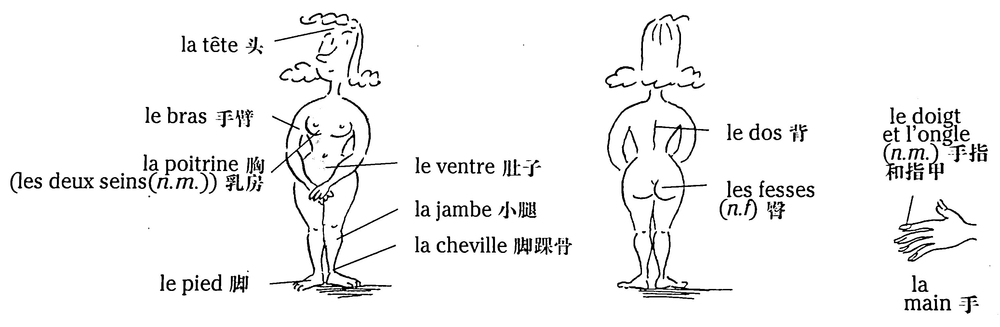
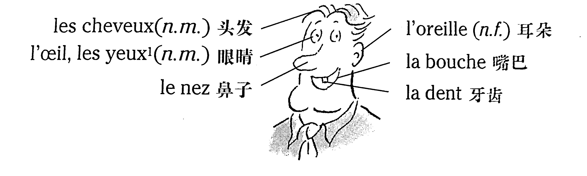
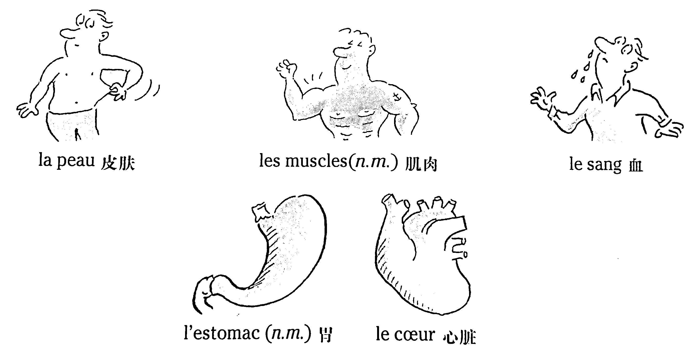

# Le corps - Les mouvements 人體——動作

## Le corps humain 人體



### Vocabulaire

```
la tête	頭
le bras	手臂
la poitrine	胸
les deux seins (n.m.)	乳房
le pied	腳
le ventre	肚子
la jambe	小腿
la cheville	腳踝骨
le dos	背
les fesses (n.f)	臀
le doigt	手指
l'ongle (n.m.)	指甲
la main	手
```

## La tête 頭部



### Vocabulaire

```
les cheveux (n.m.)	頭髮
l'œil, les yeux (n.m.)	眼睛
le nez	鼻子
l'oreille (n.f.)	耳朵
la bouche	嘴巴
la dent	牙齒
```

## Quelques parties du corps



### Vocabulaire

```
la peau	皮膚
les muscles (n.m.)	肌肉
le sang	血
l'estomac (n.m.)	胃
le cœur	心臟
```

## Le mouvement \-> La posture 動作——姿勢

* s'asseoir&emsp;&emsp;&emsp;&emsp;&emsp;&emsp;&emsp;&emsp;&emsp;&emsp;&emsp;&emsp;&emsp;&emsp;&emsp;\-> être assis

    &emsp;\- Je m'assieds sur une chaise.&emsp;&emsp;&emsp;&emsp;&emsp;\- Je suis assis sur une chaise.

    &emsp;\- Asseyez-vous ! Assieds-toi !

* se lever&emsp;&emsp;&emsp;&emsp;&emsp;&emsp;&emsp;&emsp;&emsp;&emsp;&emsp;&emsp;&emsp;&emsp;&emsp;&nbsp;&nbsp;\-> être debout

    &emsp;\- Je me lève.&emsp;&emsp;&emsp;&emsp;&emsp;&emsp;&emsp;&emsp;&emsp;&emsp;&emsp;&emsp;&nbsp;\- Je suis debout.

    &emsp;\- Levez-vous ! Lève-toi !

### Vocabulaire

```
s'asseoir (v.pron.)	坐下
une chaise	椅子
sur (prép.)	在……上面
se lever (v.pron.)	起身、起床
```

## Quelques activités 活動

* Bastien tient un ballon dans les mains, puis il lance le ballon.

    Manon court et attrape le ballon, mais après, elle tombe.

* Maxime porte un sac très lourd.

* Mathilde pose (= met) le livre sur la table ; Julien enlève le livre de la table.

* Joël marche dans la rue ; il entre dans le magasin.

    Joël sort du magasin.

* Louis apporte du champagne.

    Nadège emmène les enfants au cinéma.

    « Glaces à emporter »

    *注：帶走某人用動詞 emmener，帶走某物用動詞 emporter。*

### Vocabulaire

```
tenir (v.t.)	拿着、握着
un ballon	球
dans (prép.)	在……裡面
puis (adv.)	接着、然後
lancer (v.t.)	投、擲、抛
courir (v.i.)	跑
attraper (v.t.)	逮住、捉住
mais (conj.)	但是
après (adv.)	在……以後
tomber (v.i.)	摔倒
porter (v.t.)	提、背、扛
un sac	包
lourd, lourde (adj.)	沈重的
poser (v.t.)	放、擺
enlever (v.t.)	拿走、搬走
marcher (v.i.)	走
la rue	馬路
entrer (v.i.)	進入
le magasin	商店
sortir (v.i.)	出去
apporter (v.t.)	帶來、拿來
le champagne	香檳
emmener (v.t.)	帶走
un (une) enfant	孩子
```

