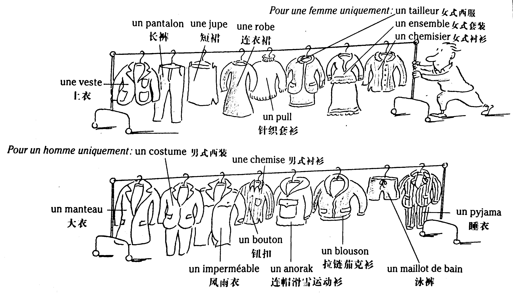
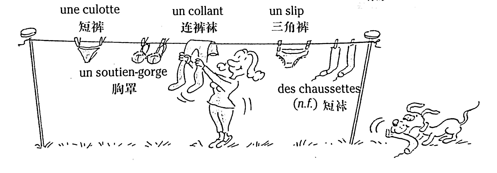

# Les vêtements - La mode 服裝——時裝

On peut être habillé ou, au contraire, nu. L'ensemble des vêtements qu'on porte est une tenue.

## Quelques vêtements 服裝

Blandine aime coudre, alors elle achète du tissu pour faire des vêtements. Elle aime faire des vêtements à la mode (&ne; démodés).



### Vocabulaire

```
habillé, habillée (adj.)	穿衣服的
nu, nue (adj.)	裸身的
uniquement (adv.)	僅僅、衹有
coudre (v.t.)	縫製
tissu (n.m.)	布
à la mode	流行、時髦
démodé, démodée (adj.)	過時的、不再流行的
une veste	上衣
un pantalon	長褲
une jupe	短裙
une robe	連衣褲
un pull	針織套衫
un tailleur	女式西服
un ensemble	女式套裝
un chemisier	女式襯衫
un manteau	大衣
un costume	男式西裝
un imperméable	風雨衣
une chemise	男式襯衫
un bouton	鈕扣
un anorak	連帽滑雪運動衫
un blouson	拉鏈茄克衫
un maillot de bain	泳褲
un pyjama	睡衣
```

## Les sous-vêtements 內衣



### Vocabulaire

```
une culotte	短褲
un soutien-gorge	胸罩
un collant	連褲襪
un slip	三角褲
des chaussettes (n.f.)	 
```

