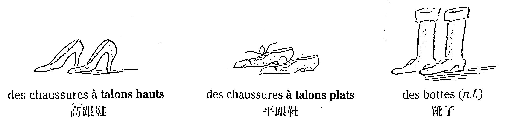
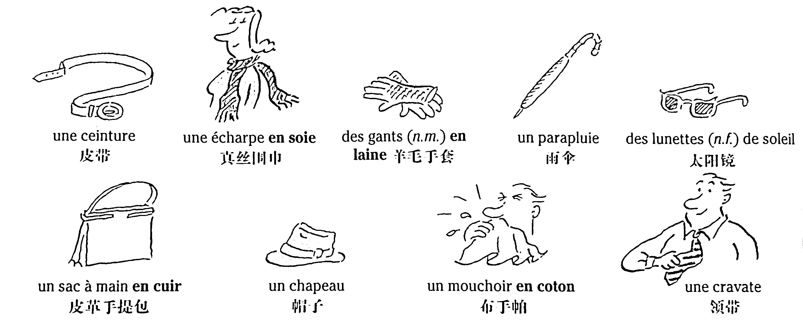
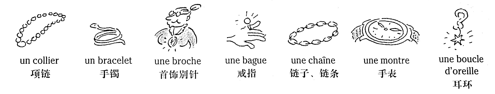

# Les vêtements - La mode 服裝——時裝

On peut être habillé ou, au contraire, nu. L'ensemble des vêtements qu'on porte est une tenue.

## Quelques vêtements 服裝

Blandine aime coudre, alors elle achète du tissu pour faire des vêtements. Elle aime faire des vêtements à la mode (&ne; démodés).


### Vocabulaire

```
habillé, habillée (adj.)	穿衣服的
nu, nue (adj.)	裸身的
uniquement (adv.)	僅僅、衹有
coudre (v.t.)	縫製
tissu (n.m.)	布
à la mode	流行、時髦
démodé, démodée (adj.)	過時的、不再流行的
une veste	上衣
un pantalon	長褲
une jupe	短裙
une robe	連衣褲
un pull	針織套衫
un tailleur	女式西服
un ensemble	女式套裝
un chemisier	女式襯衫
un manteau	大衣
un costume	男式西裝
un imperméable	風雨衣
une chemise	男式襯衫
un bouton	鈕扣
un anorak	連帽滑雪運動衫
un blouson	拉鏈茄克衫
un maillot de bain	泳褲
un pyjama	睡衣
```

## Les sous-vêtements 內衣


### Vocabulaire

```
une culotte	短褲
un soutien-gorge	胸罩
un collant	連褲襪
un slip	三角褲
des chaussettes (n.f.)	短襪
```

## Les chaussures 鞋類



### Vocabulaire

```
talon (n.m.)	鞋跟
haut, haute (adj.)	高的
plat, plate (adj.)	平的
des chaussures à talons hauts	高跟鞋
des chaussures à talons plats	平跟鞋
des bottes (n.f.)	靴子
```

## Quelques accessoires 飾物



### Vocabulaire

```
soie (n.f.)	眞絲
laine (n.f.)	羊毛
le soleil	太陽
cuir (n.m.)	皮革
une ceinture	皮帶
une écharpe en soie	眞絲圍巾
des gants (n.m.) en laine	羊毛手套
un parapluie	雨傘
des lunettes (n.f.) de soleil	太陽鏡
un sac à main en cuir	皮革手提包
un chapeau	帽子
un mouchoir en coton	布手帕
une cravate	領帶
```

## Les bijoux 首飾

Les bijoux peuvent être en or, en argent, en diamant... ou en plastique !



### Vocabulaire

```
un collier	項鏈
un bracelet	手鐲
une broche	首飾別針
une bague	戒指
une chaîne	鏈子、鏈條
une montre	手錶
une boucle d'oreille	耳環
```

## Comment tu t'habilles ? 你如何穿衣？

* Le matin, je m'habille : je mets mes vêtements. Le soir, je me déshabille, j'enlève mes vêtements.

* Aujourd'hui, Aude est en pantalon. Ce soir, elle va au théâtre, alors elle se change (= elle change de vêtements). Elle ne reste pas en pantalon, elle met une jupe habillée (= chic\*).

* Comment est-ce qu'Aude était habillée ?

    \- Elle était élégante, très chic\* comme d'habitude. Elle avait une jolie jupe noire et un haut bleu clair. Aude est toujours bien (&ne; mal) habillée.

### Vocabulaire

```
s'habiller (v.pron.)	穿衣
mettre (v.t.)	穿、戴
se déshabiller (v.pron.)	脫衣
enlever (v.t.)	脫、摘掉
être en pantalon	身着長褲
se changer (v.pron.)	更衣
rester (v.i.)	保持
une jupe habillée	漂亮的短裙
chic (adj.inv.)	帥氣的、別致的
élégant, élégante (adj.)	優美的、雅致的
comme d'habitude	如同尋常
un haut	上半身、上衣
bleu clair (adj.inv.)	淡 
```

