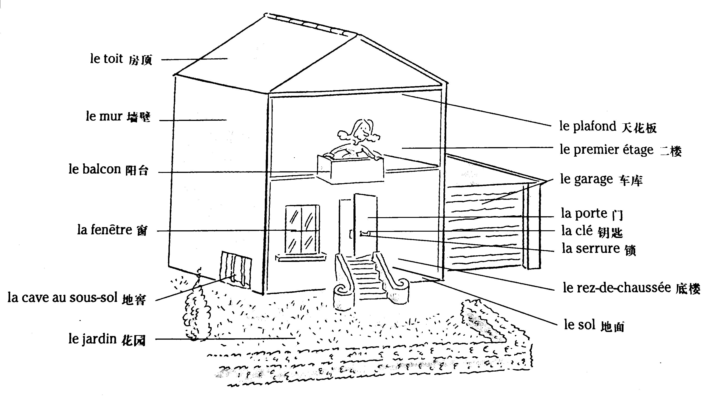
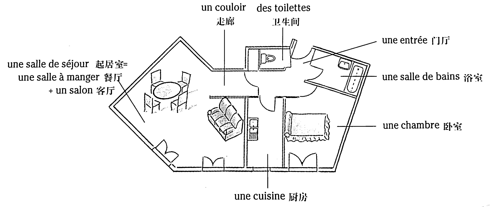
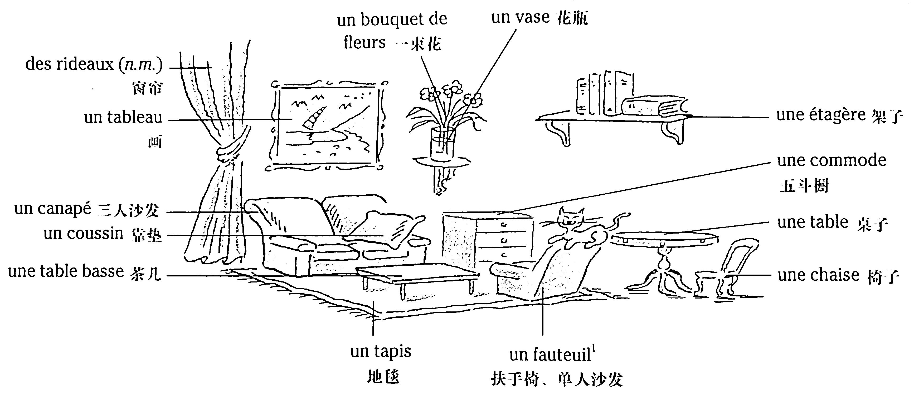
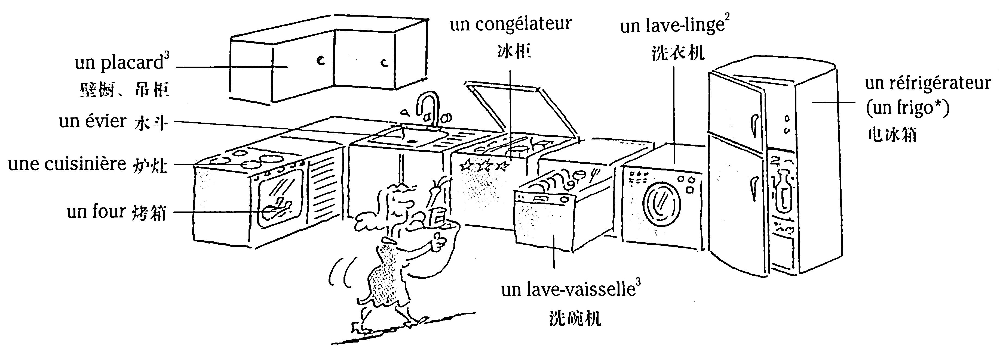
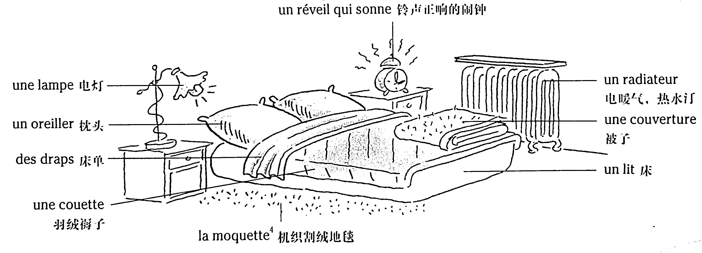
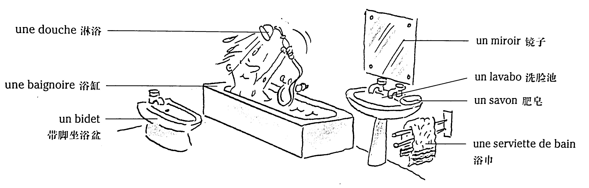

# La maison - Le logement 房子——住房

## La maison 房子



*注：如果要表達「在地上」的意思，法語不說 sur le sol，而說 par terre。如：Le livre est tombé par terre. 書掉在地上了。*

### Vocabulaire

```
le toit	房頂
le mur	牆壁
le balcon	陽臺
la fenêtre	窗
la cave au sous-sol	地窖
le jardin	花園
le plafond	天花板
le premier étage	二樓
le garage	車庫
la porte	門
la clé	鑰匙
la serrure	鎖
le rez-de-chaussée	底樓
le sol	地面
```

## Un appartement 公寓

Une maison ou un appartement ont plusieurs pièces.



une salle de séjour = une salle à manger + un salon

### Vocabulaire

```
une salle de séjour	起居室
une salle à manger	餐廳
un salon	客廳
un couloir	走廊
des toilettes	衛生間
une entrée	門廳
une salle de bains	浴室
une chambre	臥室
une cuisine	廚房
```

## Quelques meubles dans la salle de séjour 起居室的傢俱



### Vocabulaire

```
des rideaux (n.m.)	窗簾
un tableau	畫
un canapé	長沙發
un coussin	靠墊
une table basse	茶几
un bouquet de fleurs	一束花
un vase	花瓶
une étagère	架子
une commode	五斗櫥
une table	桌子
une chaise	椅子
un tapis	地毯
un fauteuil	扶手椅、單人沙發
```

## Dans le cuisine 在廚房裡



### Vocabulaire

```
un placard	壁櫥、吊櫃
un évier	洗碗槽
une cuisinière	爐竈
un four	烤箱
un congélateur	冰櫃
un lave-linge	洗衣機
un lave-vaisselle	洗碗機
un réfrigérateur (un frigo*)	電冰箱
```

## Dans la chambre 在臥室裡



### Vocabulaire

```
une lampe	電燈
un oreiller	枕頭
des draps	床單
une couette	羽絨褥子
un réveil qui sonne	鈴聲正響的鬧鐘
un radiateur	電暖氣、熱水汀
une couverture	被子
un lit	床
la moquette	機織割絨地毯
```

## Dans la salle de bains 在浴室裡



### Vocabulaire

```
une douche	淋浴
une baignoire	浴缸
un bidet	帶腳坐浴盆
un miroir	鏡子
un lavabo	洗臉池
un savon	肥皂
une serviette de bain	浴巾
```

## Habiter dans un appartement 住公寓

* Alexandre habite au quatrième étage d'un immeuble moderne. Tous les jours, il éteint la lumière avant de partir. Il ferme sa porte à clé, puis il prend l'escalier pour descendre au rez-de-chaussée.

* Le soir, quand il rentre, il ouvre sa boîte aux lettres pour prendre son courrier. Il est fatigué, alors il prend l'ascenseur pour monter au quatrième. Il ouvre sa porte et allume la lumière.

* Dans la semaine, il reste à la maison (= il reste chez lui), mais le samedi, il sort.

* Quelquefois, il reçoit (= invite) des amis à la maison.

    *Son amie Corinne frappe à la porte, parce que la sonnette ne marche pas. Normalement, Corinne sonne à la porte.*

* Alexandre n'a pas acheté son appartement, il loue son appartement : il est locataire, il n'est pas propriétaire. Tous les mois, il paye un loyer. Bien sûr, il doit aussi payer les factures d'électricité, de téléphone...
* Il aime bien son deux-pièces, mais il voudrait déménager dans un appartement plus grand et plus confortable. Il va demander des renseignements à une agence immobilière.

### Vocabulaire

```
habiter (v.t. OU v.i.)	居住
un étage	一層樓
un immeuble	高樓
moderne (adj.)	現代的
éteindre (v.t.)	熄滅的
la lumière	燈光
fermer la porte à clé	鎖門
prendre l'escalier	上樓梯
descendre (v.i.)	下來
rentrer (v.i.)	回家
une boîte aux lettres	信箱
le courrier	郵件
prendre l'ascenseur	乘電梯
monter (v.i.)	上去
ouvrir (v.t.)	打開
allumer (v.t.)	點燈
rester à la maison	呆在家裡
recevoir (inviter) (v.t.)	接待
frapper à la porte	敲門
une sonnette	門鈴
sonner (v.i.)	按門鈴
louer (v.t.)	租
un locataire	房客
un propriétaire	房東
payer un loyer	付房租
une facture	發票
un deux-pièces	兩間套居室
déménager (v.i.)	搬家
confortable (adj.)	舒適的
une agence immobilière	房屋介紹所
```

