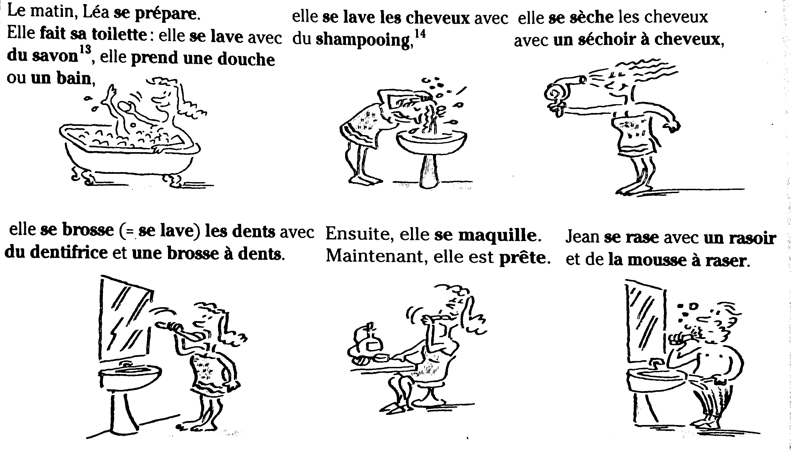
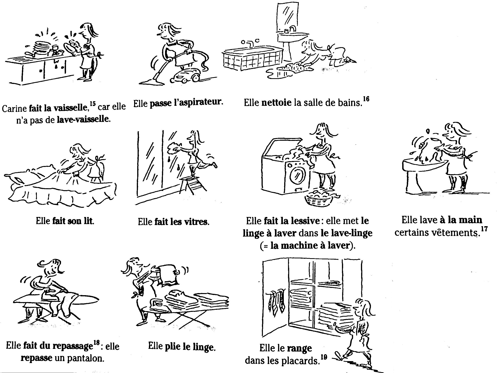
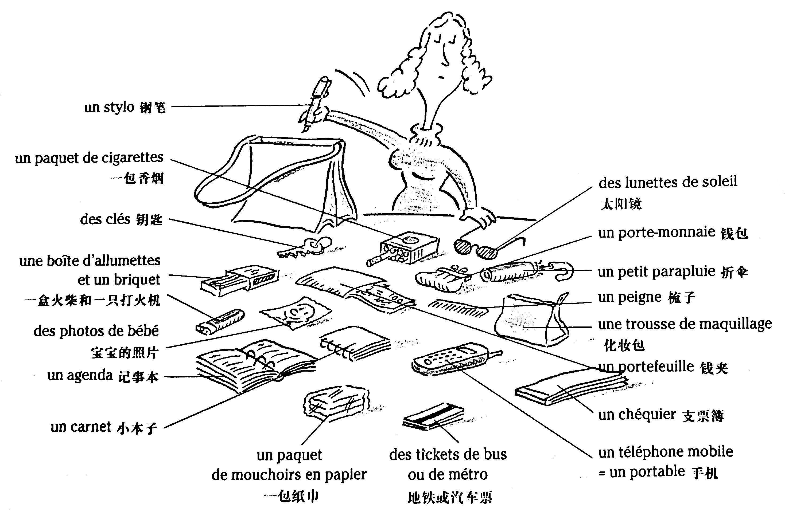
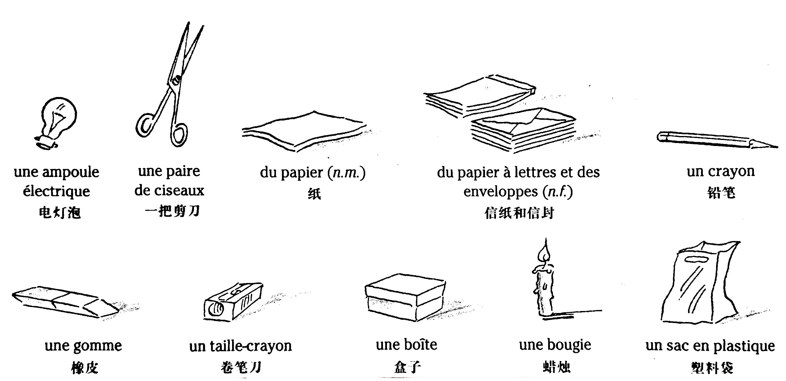

# Les activités quotidiennes 日常生活

## Le matin et le soir 早晚

* Le matin 早晨
    * Le réveil sonne à 7 heures.
    * Léa allume la lampe.
    * Jean et Léa se lèvent.
    * Ils s'habillent.
    * Léa accompagne les enfants à l'école.
    * Jean part de la maison, il part au travail.
    * La famille déjeune.
* Le soir 晚上
    * Léa va chercher les enfants à l'école.
    * Jean rentre à la maison, il rentre du travail.
    * La famille dîne.
    * Ils se déshabillent.
    * Jean et Léa se couchent.
    * Jean met le réveil à 7 heures.
    * Léa éteint la lampe.

### Vocabulaire

```
le matin	早晨
se lever (v.pron.)	起床
accompagner (v.t.)	陪、送
l'école (n.f.)	學校
partir (v.i.)	動身
le travail	工作
déjeuner (v.i.)	吃午飯
le soir	晚上
chercher (v.t.)	接（人）
dîner (v.i.)	吃晚飯
se coucher (v.pron.)	上床就寢
mettre le réveil à 7 heures	將鬧鐘撥到7點
```

## Les activités dans la journée 白天活動

* Est-ce que vous écoutez la radio ?

    \- Oui, j'allume la radio pour écouter les informations à 7 heures et demie.

    \- Est-ce que vous regardez la télévision ?

    \- Oui, j'allume la télé\* à 20 heures, mais je l'éteins après les nouvelles.

    \- Vous lisez un journal ?

    \- Oui, je lis mon journal le soir.

    \- Qu'est-ce que vous faites, quand vous rentrez le soir ?

    \- J'ouvre mon courrier, je consulte mon répondeur (= j'écoute les messages), je passe quelques coups de fil\* (= je téléphone à quelques personnes), je fais du courrier (= j'envoie des lettres).

    \- Quand est-ce que vous faites les courses ?

    \- Le samedi, en général.

    \- Qui fait le ménage dans la maison, vous ou Léa ?

    \- Heuh...

### Vocabulaire

```
écouter (v.t.)	聽
la radio	廣播
les informations (n.f.)	消息、新聞
regarder (v.t.)	看
la télévision	電視
les nouvelles (n.f.)	新聞
lire (v.t.)	讀
un journal	報紙
le courrier	郵件
consulter (v.t.)	查閱
un répondeur	錄音電話
passer un coup de fil	打電話
faire du courrier	寫信
envoyer (v.t.)	寄
une lettre	信
faire les courses	購物
faire le ménage	做家務
```

## Se préparer 梳洗準備



* Le matin, Léa se prépare. Elle fait sa toilette : elle se lave avec du savon, elle prend un douche ou un bain, elle se lave les cheveux avec du shampooing, elle se sèche les cheveux avec un séchoir à cheveux, elle se brosse (= se lave) les dents avec du dentifrice et une brosse à dents. Ensuite, elle se maquille. Maintenant, elle est prête.
* Jean se rase avec un rasoir et de la mousse à raser.

### Vocabulaire

```
faire sa toilette	梳洗
se laver (v.pron.)	洗臉、洗澡
du savon	肥皂
prendre une douche	淋浴
prendre un bain	盆浴
se laver les cheveux	洗髮
du shampooing	洗髮香波
se sécher les cheveux	吹髮
un séchoir à cheveux	電吹風
se brosser les dents	刷牙
du dentifrice	牙膏
une brosse à dents	牙刷
se maquiller (v.pron.)	化妝
prêt, prête (adj.)	準備好的
se raser (v.pron.)	刮鬍鬚
un rasoir	剃鬚刀
de la mousse à raser	剃鬚膏
```

## Faire le ménage 做家務



* Carine fait la vaisselle, car elle n'a pas de lave-vaisselle. Elle passe l'aspirateur. Elle nettoie la salle de bains. Elle fait son lit. Elle fait les vitres. Elle fait la lessive : elle met le linge à laver dans le lave-linge (= la machine à laver). Elle lave à la main certains vêtements. Elle fait du repassage : elle repasse un pantalon. Elle plie le linge. Elle le range dans le placards.

### Vocabulaire

```
faire la vaisselle	洗碗
un lave-vaisselle	洗碗機
passer l'aspirateur	使用吸塵器
nettoyer (v.t.)	打掃
faire le lit	整理床鋪
faire les vitres	擦玻璃
faire la lessive	洗衣服
le linge à laver	待洗的衣物
le lave-linge	洗衣機
la machine à laver	洗衣機
laver à la main	手洗
certains, certaines (adj. indéf.)	有些
faire du repassage	熨燙
repasser (v.t.)	熨燙
plier (v.t.)	折疊
le linge	內衣、床上用品
ranger (v.t.)	整理
```

## Les objets quotidiens

Il y a beaucoup de choses dans le sac à main de Lise !



### Vocabulaire

```
un stylo	鋼筆
un paquet de cigarettes	一包香菸
des clés	鑰匙
une boîte d'allumettes	一盒火柴
un briquet	一隻打火機
des photos de bébé	寶寶的照片
un agenda	記事本
un carnet	小本子
des lunettes de soleil	太陽鏡
un porte-monnaie	錢包
un petit parapluie	折傘
un peigne	梳子
une trousse de maquillage	化妝包
un portefeuille	錢夾
un chéquier	支票薄
un téléphone mobile	手機
un portable	手機
un paquet de mouchoirs en papier	一包紙巾
des tickets de bus ou de métro	地鐵或汽車票
```

## Quelques objets utiles à la maison 家用必備品



### Vocabulaire

```
une ampoule électrique	電燈泡
une paire de ciseaux	一把剪刀
du papier	紙
du papier à lettres	信紙
des enveloppes	信封
un crayon	鉛筆
une gomme	橡皮
un taille-crayon	卷筆刀
une boîte	盒子
une bougie	蠟燭
un sac en plastique	塑料袋
```

