# Les produits alimentaires - Les commerces 食品——商品

On peut acheter des légumes et des fruits **frais** chez **le marchand de fruits et légumes.**

## Quelques légumes 蔬菜

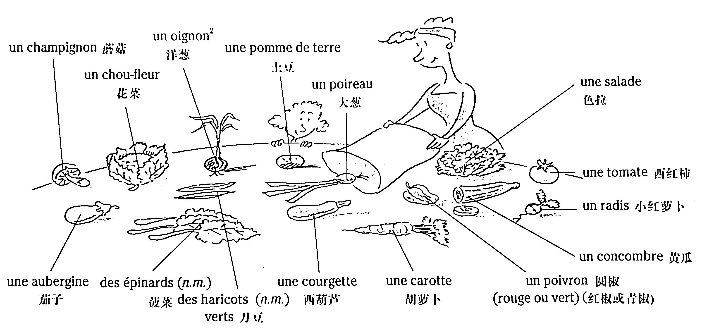

On mange les légumes **crus** (comme par exemple les radis, les concombres...) ou, au contraire, **cuits** (les pommes de terre, les haricots verts, les poireaux...). Dans un bistrot, on peut demander « **une assiette de crudités** », c'est-à-dire une assiette de légumes crus.

### Vocabulaire

```
un champignon	蘑菇
un chou-fleur	花菜
un oignon	洋蔥
une pomme de terre	土豆
un poireau	大蔥
une salade	色拉
une tomate	西紅柿
un radis	小紅蘿蔔
un concombre	黃瓜
une aubergine	茄子
des épinards (n.m.)	菠菜
des haricots (n.m.) verts	刀豆
une courgette	西葫蘆
une carotte	胡蘿蔔
un poivron	圓椒
un poivron rouge	紅椒
un poivron vert	青椒
```

## Quelques fruits 水果

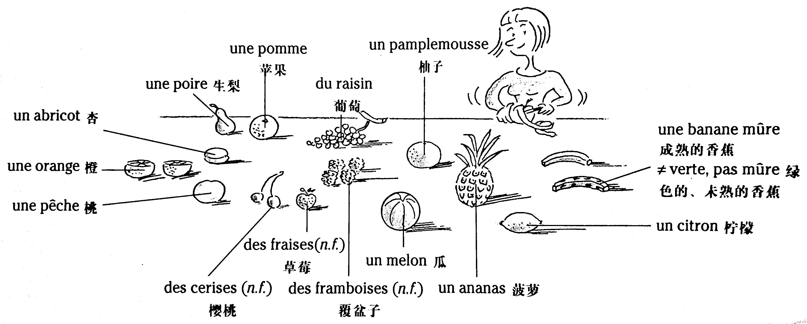

Anne **épluche** un fruit.

### Vocabulaire

```
un abricot	杏
une orange	橙
une pêche	桃
une poire	生梨
une pomme	蘋果
du raisin	葡萄
un pamplemousse	柚子
une banane mûre	成熟的香蕉
une banane verte, pas mûre	綠色的、未熟的香蕉
un citron	檸檬
des cerises (n.f.)	櫻桃
des fraises (n.f.)	草莓
des framboises (n.f.)	覆盆子
un melon	瓜
un ananas	菠蘿
```

## Le poisson 魚類

On achète le poisson et les fruits de mer **chez le poissonnier** (= **à la poissonnerie**).

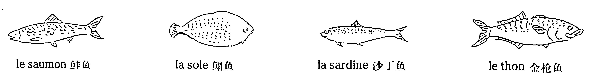

* \- Est-ce que vous pouvez **préparer** le poisson ?

    \- Oui, madame. J'**enlève la tête et les arêtes** ?

### Vocabulaire

```
poissonnier (n.m.)	魚商
poissonnerie (n.f.)	魚鋪
arête (n.f.)	魚骨、魚刺
le saumon	鮭魚
la sole	鰨魚
la sardine	沙丁魚
le thon	金槍魚
```

## Les fruits de mer 海鮮

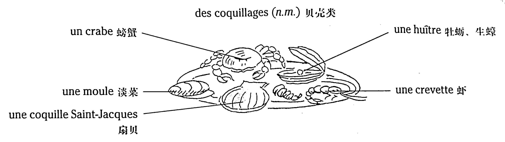

### Vocabulaire

```
un crabe	螃蟹
une moule	淡菜
une coquille Saint-Jacques	扇貝
des coquillages (n.m.)	貝殼類
une huître	牡蠣、生蠔
une crevette	蝦
```

## La viande 肉類

On achète la viande **chez le boucher** (= **à la boucherie**) ; pour la viande de porc, plus particulièrement, on va **chez le charcutier** (= **à la charcuterie**).

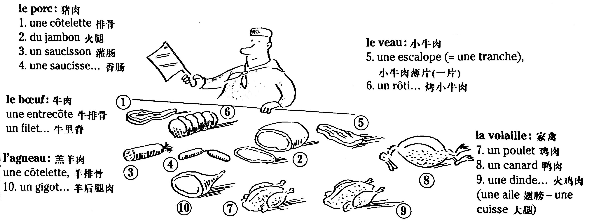

*注：法國人除把豬肉歸爲 charcuterie 以外，把豬肉製品，如香腸、灌腸、豬肉糜等也歸屬於「charcuterie」。顧客在酒吧間可以點一道 assiette de charcuterie，即香腸之類的豬肉製品菜肴。*

### Vocabulaire

```
boucher (n.m.)	肉商
boucherie (n.f.)	肉鋪
charcutier (n.m.)	豬肉食品商
charcuterie (n.f.)	豬肉食品店
le porc	豬肉
une côtelette	排骨、羊排骨
du jambon	火腿
un saucisson	灌腸
une saucisse	香腸
le veau	小牛肉
une escalope	小牛肉薄片
une tranche	一片
un rôti	烤小牛肉
le bœuf	牛肉
une entrecôte	牛排骨
un filet	牛裡脊
l'agneau (n.m.)	羔羊肉
un gigot	羊後腿肉
la volaille	家禽
un poulet	雞肉
un canard	鴨肉
une dinde	火雞肉
une aile	翅膀
une cuisse	大腿
```

## Les produits laitiers 奶製品

* Les fromages 奶酪

    * On achète du bon fromage **chez un fromager** (= **à la fromagerie**).
    * On dit qu'il y a 365 sortes de fromages en France !
    * Quelques fromages : **le camembert**, **le roquefort**, **le brie**, **le fromage de chèvre**...

* La crèmerie 乳品

    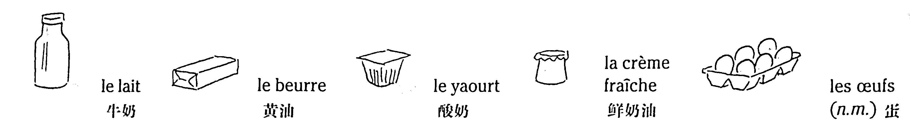

    *注：如果農副産品後面跟 fermier 的形容詞，就表示這個産品的質量比較好。如：camembert fermier 農莊卡門培爾乾酪。œufs fermiers 農莊（新鮮）雞蛋。*

### Vocabulaire

```
camembert (n.m.)	卡門培爾乾酪
roquefort (n.m.)	羅克福爾乾酪
brie (n.m.)	布里乾酪
le lait	牛奶
le beurre	黃油
le yaourt	酸奶
la crème fraîche	鮮奶油
les œufs (n.m.)	蛋
```

## Les produits de base 基本食品

On peut acheter ces produits dans **une épicerie** = **un** petit **supermarché**.

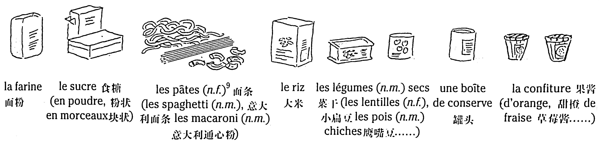

### Vocabulaire

```
épicerie (n.f.)	食品雜貨店
supermarché (n.m.)	超市
la farine	麫粉
le sucre	食糖
en poudre	粉狀
en morceaux	塊狀
les pâtes (n.f.)	麫條
les spaghetti (n.m.)	意大利麫條
les macaroni (n.m.)	意大利通心粉
le riz	大米
les légumes (n.m.) secs	菜乾
les lentilles (n.f.)	小扁豆
les pois (n.m.) chiches	鷹嘴豆
une boîte de conserve	罐頭
la confiture	果醬
la confiture d'orange	甜橙醬
la confiture de fraise	草莓醬
```

## Les condiments 調味品

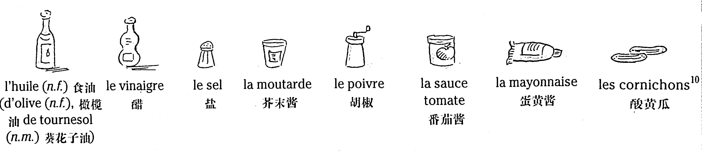

### Vocabulaire

```
l'huile (n.f.)	食油
l'huile d'olive (n.f.)	橄欖油
l'huile de tournesol (n.m.)	葵花子油
le vinaigre	醋
le sel	鹽
la moutarde	芥末醬
le poivre	胡椒
la sauce tomate	番茄醬
la mayonnaise	蛋黃醬
les cornichons	酸黃瓜
```

## Le pain, la pâtisserie, les sucreries 麫包、糕點、糖果

Pour acheter du pain, on va chez **le boulanger** (= à **la boulangerie**), et pour acheter des **gâteaux**, on va chez **le pâtissier** (= à **la pâtisserie**).

Voici quelques spécialités françaises.

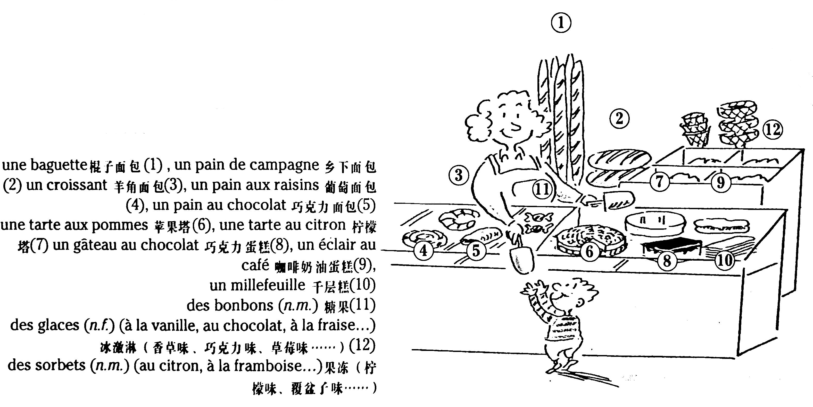

*注：去某個商店買東西，我們可以用這個商店的名稱，如 la boulangerie，也可以用職業名稱，le boulanger。衹不過要注意介詞的搭配：Je vais à la boulangerie. Je vais chez le boulanger. 我去麫包店。*

### Vocabulaire

```
boulanger (n.m.)	麫包師
boulangerie (n.f.)	麫包房
pâtissier (n.m.)	糕點師
pâtisserie (n.f.)	糕點鋪
une baguette	棍子麫包
un pain de campagne	鄉下麫包
un croissant	羊角麫包
un pain aux raisins	葡萄麫包
un pain au chocolat	巧克力麫包
une tarte aux pommes	蘋果塔
une tarte au citron	檸檬
un gâteau au chocolat	巧克力蛋榚
un éclair au café	咖啡奶油蛋糕
un millefeuille	千層糕
des bonbons (n.m.)	糖果
des glaces (n.f.) (à la vanille, au chocolat, à la fraise...)	冰激淋（香草味、巧克力味、草莓味……）
des sorbets (n.m.) (au citron, à la framboise...)	冰糕（檸檬味、覆盆子味）
```

## Les boissons 飲料

* Le vin et les alcools 葡萄酒和燒酒

    On peut acheter du vin et des alcools dans un supermarché, mais aussi chez **un marchand de vin**.

    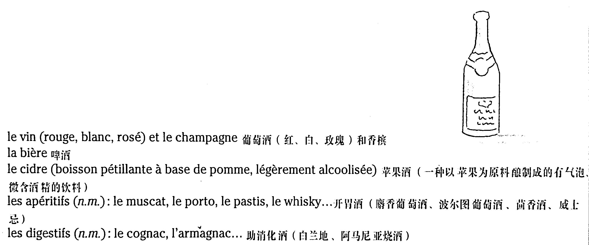

    ```
    le vin (rouge, blanc, rosé)	葡萄酒（紅、白、玫瑰）
    le champagne	香檳
    la bière	啤酒
    le cidre (boisson pétillante à base de pomme, légèrement alcoolisée)	蘋果酒（一種以蘋果爲原料酿製成的有氣泡、微含酒精的飲料）
    les apéritifs (n.m.)	開胃酒
    le muscat	麝香葡萄酒
    le porto	波爾圖葡萄酒
    le pastis	茴香酒
    le whisky	威士忌
    les digestifs (n.m.)	助消化酒
    le cognac	白蘭地
    l'armagnac	阿馬尼亞燒酒
    ```

* Les boissons sans alcool 不含酒精的飲料

    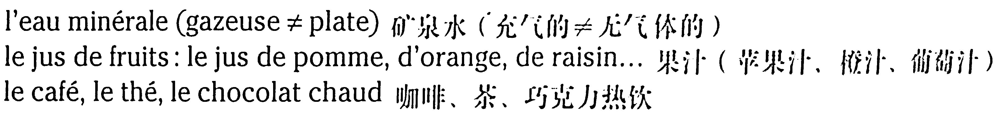

    ```
    l'eau minérale	礦泉水
    l'eau gazeuse	汽水
    l'eau plate	無汽水
    le jus de fruits	果汁
    le jus de pomme	蘋果汁
    le jus d'orange	橙汁
    le jus de raisin	葡萄汁
    le café	咖啡
    le thé	茶
    le chocolat chaud	巧克力熱飲
    ```

    