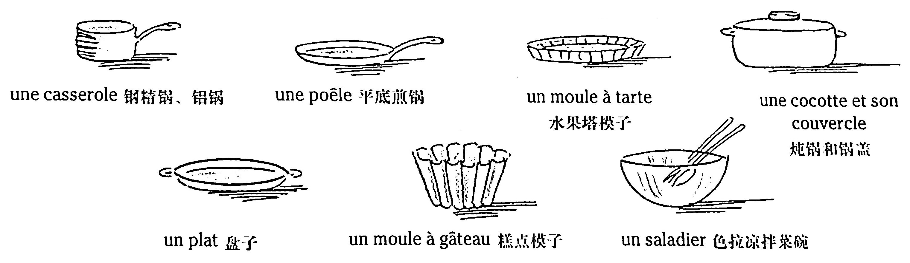
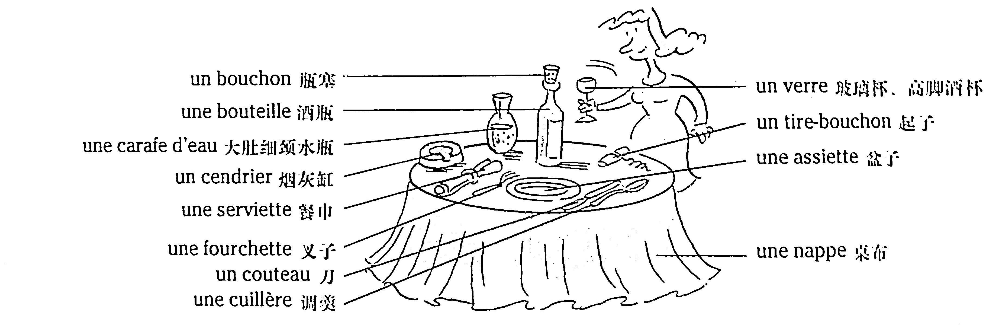
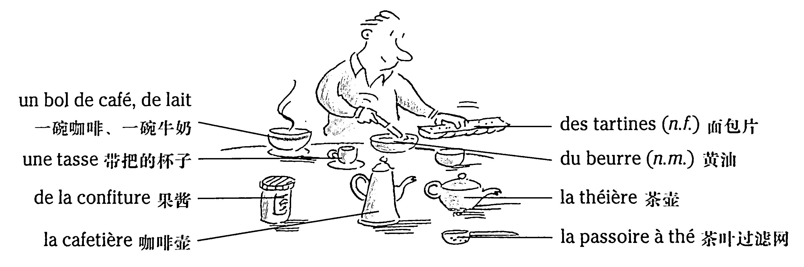

# Les cuisine - Les repas 烹飪——就餐

* Pierre aime faire la cuisine : c'est un très bon cuisinier. Il fait (= prépare) un bon plat. Il cherche une recette dans un livre de cuisine.

    \- *J'ai fait une tarte aux pommes hier soir.*

    \- *J'ai préparé un poulet à la moutarde.*

* Brice est cuisinier professionnel, il est chef dans un restaurant.

### Vocabulaire

```
faire la cuisine	做飯
cuisinier, cuisinière (n.)	廚師
préparer un bon plat	準備一道好菜
chercher une recette	找食譜
un livre de cuisine	食譜
```

## Quelques ustensiles de cuisine 廚房炊具



### Vocabulaire

```
une casserole	鋼精鍋、鋁鍋
une poêle	平底煎鍋
un moule à tarte	水果塔模子
une cocotte et son couvercle	炖鍋和鍋蓋
un plat	盤子
un moule à gâteau	糕點模子
un saladier	色拉凉拌菜碗
```

## La table 餐桌

Avant de manger, Isabelle met la table.



### Vocabulaire

```
un bouchon	瓶塞
une bouteille	酒瓶
une carafe d'eau	大肚細頸水瓶
un cendrier	菸灰缸
une serviette	餐巾
une fourchette	叉子
un couteau	刀
une cuillère	調羹
un verre	玻璃杯、高腳酒杯
un tire-bouchon	起子
une assiette	盤子
une nappe	桌布
```

## Le petit déjeuner 早餐



### Vocabulaire

```
un bol de café	一碗咖啡
un bol de lait	一碗牛奶
une tasse	帶把的杯子
de la confiture	果醬
la cafetière	咖啡壺
des tartines (n.f.)	麫包片
du beurre	黃油
la théière	茶壺
la passoire à thé	茶葉過濾網
```

## Bon appétit ! 祝您胃口好！

* Quand on a faim, on mange ; quand on a soif, on boit un verre d'eau, de vin...
* Il y a, en général, trois repas : le matin, les Français prennent le petit déjeuner ; à midi, ils déjeunent, le soir, ils dînent. Vers 16 heures, c'est l'heure du goûter : les enfants mangent un petit gâteau et boivent un jus de fruit, par exemple.

*注：法語中早中晚餐各有名詞：le petit déjeuner, le déjeuner, le dîner。但衹有中餐和晚餐才有自己的動詞：déjeuner 和 dîner。吃早餐沒有專門的動詞，衹能說：prendre un petit déjeuner.*

### Vocabulaire

```
avoir faim	餓
avoir soif	渴
boire (v.t.)	喝
un repas	一頓飯
prendre le petit déjeuner	吃早飯
déjeuner (v.i.)	吃午飯
dîner (v.i.)	吃晚飯
le goûter	下午茶
```

## Au restaurant 在飯店

* Un repas au restaurant est généralement composé d'une entrée, d'un plat principal et d'un fromage ou un dessert.

    Le serveur : &emsp;&emsp;\- Monsieur, vous avez choisi ?

    Le client : &emsp;&emsp;&emsp;\- Oui, je voudrais un menu à 18&euro;, s'il vous plaît.

    Le serveur : &emsp;&emsp;\- Oui, monsieur. Qu'est que vous prenez, comme entrée ?

    Le client : &emsp;&emsp;&emsp;\- C'est quoi\*, la salade gourmande ?

    Le serveur : &emsp;&emsp;\- C'est une salade verte, avec des haricots verts, du foie gras, des petites tomates. C'est délicieux !

    Le client : &emsp;&emsp;&emsp;\- D'accord, une salade gourmande, alors.

    Le serveur : &emsp;&emsp;\- Et comme plat ?

    Le client : &emsp;&emsp;&emsp;\- Un canard à l'orange. Comme dessert, je vais prendre la crème brûlée.

    Le serveur : &emsp;&emsp;\- Et comme boisson ?

    Le client : &emsp;&emsp;&emsp;\- Une demi-bouteille de côtes-du-rhône rouge, s'il vous plaît.

    *Une heure plus tard.*

    Le client : &emsp;&emsp;&emsp;\- Un café et l'addition, s'il vous plaît !

### Vocabulaire

```
être composé de	由……組成
une entrée	第一道正菜
un plat principal	主菜
un dessert	飯後甜點
Vous avez choisi ?	您選好了嗎？
un menu	套餐
du foie gras	肥鵝肝
délicieux, délicieuse (adj.)	鮮美的、口感好的
Et comme plat ?	主菜呢？（您吃什麽主菜？）
un canard à l'orange	甜橙烤鴨
la crème brûlée	焦糖蛋奶凍
l'addition (n.f.)	結帳
```

