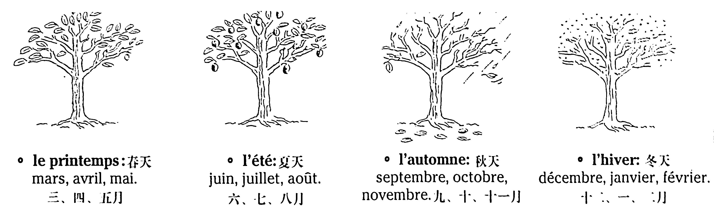
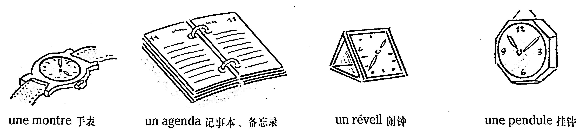

# Le temps qui passe 時間

## Les quatre saisons et les mois de l'année 一年的四季和月份



### Vocabulaire

```
le printemps	春天
l'été (n.m.)	夏天
l'automne (n.m.)	秋天
l'hiver (n.m.)	冬天
mars (n.m.)	三月
avril (n.m.)	四月
mai (n.m.)	五月
juin (n.m.)	六月
juillet (n.m.)	七月
août (n.m.)	八月
septembre (n.m.)	九月
octobre (n.m.)	十月
novembre (n.m.)	十一月
décembre (n.m.)	十二月
janvier (n.m.)	一月
février (n.m.)	二月
```

## Les jours de la semaine 一週七天

* les jours « ouvrables » : lundi, mardi, mercredi, jeudi, vendredi.
* le week-end : samedi, dimanche.

*注：按理說，一週7天，兩週14天。但法國人卻習慣把一週說成8天，把兩週說成15天。如：Il prend huit jours de vacances. 他度假一週。 Elle revient dans quinze jours. 她兩週以後回來。*

### Vocabulaire

```
les jours ouvrables	工作日
le week-end	週末
lundi (n.m.)	星期一
mardi (n.m.)	星期二
mercredi (n.m.)	星期三
jeudi (n.m.)	星期四
vendredi (n.m.)	星期五
samedi (n.m.)	星期六
dimanche (n.m.)	星期日
```

## La date 日期

* Quelle est la date, aujourd'hui ?

    \- Nous sommes le 31 octobre (« le trente et un »).

    \- Nous sommes mardi 27 mars 2001.

* Quel jour sommes-nous ?

    \- Nous sommes mercredi.

* Nous sommes le combien, aujourd'hui ?

    \- Nous sommes le 9.

*注：法國人說每月的1號用序數詞 le premier，但是從2號開始就用基數詞了。*

### Vocabulaire

```
quel, quelle (adj.)	什麽
la date	日期
quel jour	星期幾
le combien	幾號
```

## La journée 白天

* le matin - l'après-midi - le soir - la nuit
* En été, il fait jour à 6 heures ; en hiver, il fait nuit à 17 heures.
* L'emploi du temps : *J'ai un rendez-vous mardi matin ; je ne travaille pas vendredi après-midi ; je dîne avec Joël samedi soir.*

### Vocabulaire

```
le matin	早晨
l'après-midi (n.m. OU n.f.)	下午
le soir	晚上
la nuit	夜
il fait jour	天亮
il fait nuit	天黑
l'emploi du temps (n.m.)	時間表
```

## Dire l'heure 說鐘點

* Vous avez l'heure ? Quelle heure est-il ? Quelle heure il est\* ?

    \- Il est...

    <table>
        <tbody>
        	<tr>
            	<td><strong>expression usuelle</strong></td>
                <td><strong>expression officielle</strong></td>
            </tr>
            <tr>
            	<td>huit heures</td>
                <td>
                    8h00 (huit heures) OU<br />
                    20h00 (vingt heures)
                </td>
            </tr>
            <tr>
            	<td>huit heures et quart</td>
                <td>
                    8h15 (huit heures quinze) OU<br />
                    20h15 (vingt heures quinze)
                </td>
            </tr>
            <tr>
            	<td>neuf heures moins le quart</td>
                <td>
                	8h45 (huit heures quarante-cinq) OU <br />
                    20h45 (vingt heures quarante-cinq)
                </td>
            </tr>
            <tr>
            	<td>midi</td>
                <td>12h00 (douze heures)</td>
            </tr>
            <tr>
            	<td>minuit</td>
                <td>0h00 (zéro heure)</td>
            </tr>
        </tbody>
    </table>

*注：在廣播、電視、火車、飛機時刻表中，用二十四小時的正式計時制。如：Le train part à 14h47. 火車14時47分開。但在日常生活中，人們一般用十二小時計時制。如果擔心會混淆，就加上「早晨」、「晚上」。如 \- À quelle heure est-ce que tu pars ? 你幾點動身？ \- À huit heures du soir. 晚上8點。 \- À quelle heure tu t'es couché ? 你幾點上床睡覺的？ \- À trois heures du matin ! 淩晨3點！* 

### Vocabulaire

```
Vous avez l'heure ?	請問幾點鐘？
Quelle heure est-il ?	現在幾點鐘？
il est...	現在XX點鐘
expression usuelle	常用表達
expression officielle	正式場合表達
```

## La durée 時間的持續

<table>
	<tbody>
    	<tr>
        	<td align="center"><br /><br /><strong>J'ai passé...</strong></td>
            <td>
                <strong>un quart d'heure</strong> (= 15 minutes)...<br />
                <strong>une demi-heure</strong> (= 30 minutes)...<br />
                <strong>trois quarts d'heure</strong> (= 45 minutes)...<br />
                <strong>toute la journée</strong>...<br />
                <strong>toute la soirée</strong>...
            </td>
            <td align="center"><br /><br /><strong>à</strong> étudier le français !</td>
        </tr>
    </tbody>    
<table>

*注：表示「做事情做了多少時間」，可用 **passer** + 時間 + **à faire quelque chose**。如：J'ai **passé** la journée **à** lire. 我看書看了一整天。 Il a **passé** deux heures **à** téléphoner. 他打電話打了兩小時。*

### Vocabulaire

```
passer (v.t.)	度過
un quart d'heure	一刻鐘
une minute	一分鐘
une demi-heure	半小時
trois quarts d'heure	三刻鐘
toute la journée	一整天
toute la soirée	整個晚上
```

## Quelques objets 計時物品



### Vocabulaire

```
une montre	手錶
un agenda	記事本、備忘錄
un réveil	鬧鐘
une pendule	掛鐘
```

## Quelques fêtes et traditions 節日與傳統

Il y a beaucoup de jours fériés, en France (= on ne travaille pas ces jours-là). Il existe des fêtes religieuses et des fêtes civiles.

* À Pâques, on offre des œufs en chocolat ; à Noël, on a un sapin de Noël et on offre des cadeaux.
* Le 1<sup>er</sup> janvier (« le jour de l'An »), on souhaite « la bonne année », on envoie des cartes de vœux aux personnes qu'on aime bien.
* Le 1<sup>er</sup> mai (« la fête du Travail »), on offre une fleur (du muguet).
* Le 14 juillet (la fête nationale), il y a un défilé militaire, un feu d'artifice et un bal.
* Le jour des Rois (le 6 janvier) n'est pas férié, mais on mange un bon gâteau, « la galette des Rois ».

## Quelques expressions de temps 幾種時間表達方法

* Ce matin, j'ai mis dix heures en voiture pour aller de Paris à Lyon ! C'est complètement fou ! Normalement, je mets cinq heures. En train, il faut (= ça prend) deux heures pour aller de Paris à Lyon.

    &#8594; mettre du temps (c'est personnel, ça dépend des circonstances).

    &#8594; ça prend du temps = il faut (c'est impersonnel, officiel, sûr).

* Benjamin a rendez-vous avec Virginie à 19 heures : 

    \- à 18h45, il est en avance.

    \- à 19h00, il est à l'heure.

    \- à 19h15, il est en retard.

* Ce matin, Véronique est partie tôt de chez elle, elle est partie à 7 heures ; elle va rentrer tard, pas avant 11 heures du soir.

* Est-ce que tu as le temps de prendre un café avec moi ?

    \- Non, excuse-moi, je suis pressé, j'ai un rendez-vous !

*注：注意不要把下面兩個意思混爲一談：\- Vous avez l'heure ? 幾點鐘？ \- Vous avez le temps ? Vous avez deux minutes ? 您有時間嗎？您有兩分鐘的時間嗎？ \- Oui, il est midi et demi. 中午12點半。 \- Non, excusez-moi, je suis pressé. 不，請原諒，我有事。*  

